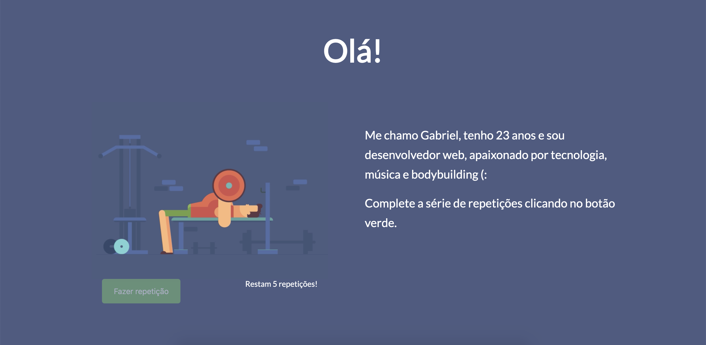
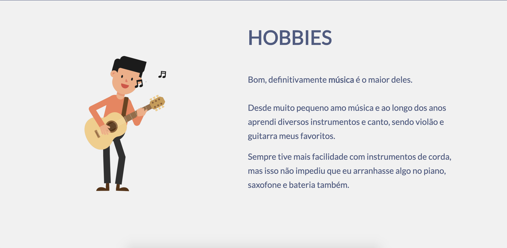

<h1 align="center">
    KOBETHON
</h1>

<h4 align="center">
  ReactJS website telling about me, it is part of Kobe's hackathon.
</h4>

<p align="center">
  <a href="#rocket-technologies">Technologies</a>&nbsp;&nbsp;&nbsp;|&nbsp;&nbsp;&nbsp;
  <a href="#information_source-how-to-use">How To Use</a>
</p>


<p align="center">
  
  
  
</p>

## :rocket: Technologies

This project was developed with the following technologies:

-  [ReactJS](https://reactjs.org/)
-  [styled-components](https://www.styled-components.com/)
-  [react-icons](https://react-icons.github.io/react-icons/)
-  [VS Code][vc] with [ESLint][vceslint]

## :information_source: How To Use

To clone and run this application, you'll need [Git](https://git-scm.com), [Node.js v10.16][nodejs] or higher + [Yarn v1.13][yarn] or higher installed on your computer. From your command line:

```bash
# Clone this repository
$ git clone git@github.com:GabrielHorbach/kobethon.git

# Go into the repository
$ cd kobethon

# Install dependencies
$ yarn install

# Run the app
$ yarn start

# Build the app
$ yarn build
```

---

[nodejs]: https://nodejs.org/
[yarn]: https://yarnpkg.com/
[vc]: https://code.visualstudio.com/
[vceslint]: https://marketplace.visualstudio.com/items?itemName=dbaeumer.vscode-eslint